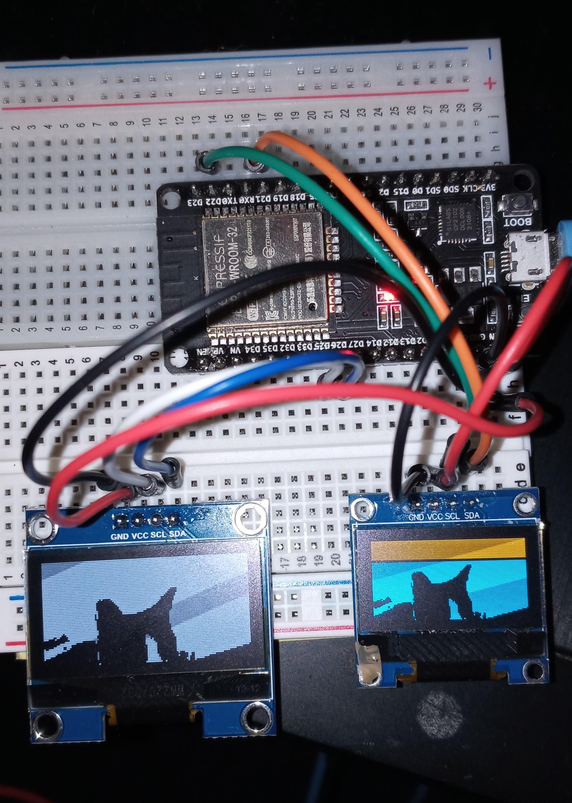

# esp32-picbooth

## What is this?
Take a selfie and  upload it to your esp32 OLED screen.

Maybe your cat?

## What is this (II)?
It is also possible to run https://guvcview.sourceforge.net/ on a Raspberry Pi / Eee Pc like a real "Picture Booth" and have that image show on the esp32's OLED.
That was the orignal intent. 

## Why?
This can be a fun ice-breaker at  a social gathering like Thanksgiving or wherever humans gather.

## Requirements
- esp32
- Raspberry Pi or equivalent like EEE PC running linux

## Setup
- In order to set this up you'll first install your esp32 on your wireless network and connect an OLED screen.
For fun, in this project I have 2 OLED screens connected to the esp32 using the ssd1306 driver as well as the sh1106  driver. 

- Since the esp32 is not powerful enough to process images and does not have the pillow package you'll need another computer like a Raspberry Pi to process the images. This machine will be running Flask and will accept the uploaded images, process them and make available a text string that the esp32 will consume to be able to  display the image on its OLED.

I would strongly recommend reviewing the Brilliant Walk Through to understand the set up 

## Hints
Lighting is EVERYTHING!

## References
- sh1106 driver

https://github.com/robert-hh/SH1106/blob/master/sh1106.py

- Gurgle Apps (base64 and ssd1306 driver)

https://github.com/gurgleapps/image-to-code

https://gurgleapps.com/tools/image-to-code

- Brilliant Walk Through

https://www.youtube.com/watch?v=MOI9qBAAClo&t=728s

- Flask Reuploaded

https://pypi.org/project/Flask-Reuploaded/

- ESP32 PINOUTS / HW

https://docs.micropython.org/en/latest/esp32/quickref.html#hardware-i2c-bus

https://lastminuteengineers.com/esp32-pinout-reference/

https://docs.micropython.org/en/latest/esp32/quickref.html

https://microcontrollerslab.com/esp32-pinout-use-gpio-pins/

https://electronics.stackexchange.com/questions/583433/is-it-possible-to-use-two-i2c-interfaces-with-the-esp32-using-micropython

